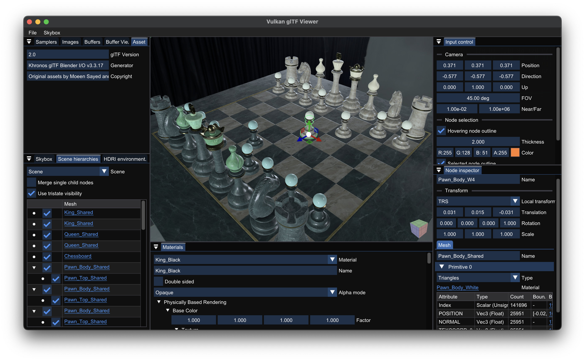

# Vulkan glTF Viewer


Blazingly fast[^1] Vulkan glTF viewer.



## Features

- **glTF 2.0 conformant**, especially:
  - PBR material rendering with runtime IBL resources (spherical harmonics + pre-filtered environment map) generation from input equirectangular map.
  - Runtime missing tangent attribute generation using MikkTSpace algorithm for indexed geometry.
  - Runtime missing per-face normal and tangent attribute generation for non-indexed geometry.
  - `OPAQUE`, `MASK` (using alpha testing and Alpha To Coverage) and `BLEND` (using Weighted Blended OIT) materials.
  - All primitive modes, including emulated `LINE_LOOP` support as Vulkan does not support it natively.
  - Normalized and sparse accessors.
  - Infinite morph targets and skinning attributes.
  - Multiple scenes.
  - Binary format (`.glb`).
- Support glTF 2.0 extensions:
  - [`KHR_materials_emissive_strength`](https://github.com/KhronosGroup/glTF/tree/main/extensions/2.0/Khronos/KHR_materials_emissive_strength)
  - [`KHR_materials_ior`](https://github.com/KhronosGroup/glTF/tree/main/extensions/2.0/Khronos/KHR_materials_ior)
  - [`KHR_materials_unlit`](https://github.com/KhronosGroup/glTF/tree/main/extensions/2.0/Khronos/KHR_materials_unlit) for lighting independent material shading
  - [`KHR_materials_variants`](https://github.com/KhronosGroup/glTF/tree/main/extensions/2.0/Khronos/KHR_materials_variants)
  - [`KHR_mesh_quantization`](https://github.com/KhronosGroup/glTF/tree/main/extensions/2.0/Khronos/KHR_mesh_quantization)
  - [`KHR_texture_basisu`](https://github.com/KhronosGroup/glTF/tree/main/extensions/2.0/Khronos/KHR_texture_basisu) for BC7 GPU compression texture decoding
  - [`KHR_texture_transform`](https://github.com/KhronosGroup/glTF/tree/main/extensions/2.0/Khronos/KHR_texture_transform)
  - [`EXT_mesh_gpu_instancing`](https://github.com/KhronosGroup/glTF/tree/main/extensions/2.0/Vendor/EXT_mesh_gpu_instancing) for instancing multiple meshes with the same geometry
- Use 4x MSAA by default.
- Support HDR and EXR skybox.
- File loading using platform-native file dialog.
- Pixel perfect node selection and transformation using [ImGuizmo](https://github.com/CedricGuillemet/ImGuizmo).
- Arbitrary sized outline rendering using [Jump Flooding Algorithm](https://en.wikipedia.org/wiki/Jump_flooding_algorithm).
- Adjust node visibility in scene hierarchy tree.
- GUI for used asset resources (buffers, images, samplers, etc.) list with docking support.

## Performance

Click the below image will redirect the page to the YouTube video (due to the GitHub's policy, I cannot directly embed the video into markdown).

[](https://youtu.be/MJ6-TLp0vtk)

See [Performance Comparison](docs/performance-comparison.md) page for the performance comparison with other desktop glTF viewers.

I initially developed this application for leveraging Vulkan's performance and using some modern GPU features, like bindless/GPU driven rendering/etc. There are two main goals for this application: speed and memory consumption. Here are some key points:

### Speed

- Fully bindless: no descriptor set update/vertex buffer binding during rendering.
  - Descriptor sets are only updated at the model loading time.
  - Textures are accessed with runtime-descriptor indexing using [`VK_EXT_descriptor_indexing`](https://docs.vulkan.org/samples/latest/samples/extensions/descriptor_indexing/README.html) extension.
  - Use Vertex Pulling with [`VK_KHR_buffer_device_address`](https://docs.vulkan.org/samples/latest/samples/extensions/buffer_device_address/README.html). Only index buffers are bound to the command buffer.
- Fully GPU driven rendering: uses both instancing and multi draw indirect with optimally sorted rendering order. **Regardless of the material count and scene's complexity, all scene nodes can be rendered with fixed amount of draw calls**.
- Significant less asset loading time: **glTF buffer memories are directly `memcpy`ed into the GPU memory with dedicated transfer queue. No pre-processing is required!**
  - Thanks to the vertex pulling, pipeline is vertex input state agnostic, therefore no pre-processing is required.
  - Also, it considers whether the GPU is UMA (unified memory architecture) or not, and use the optimal way to transfer the buffer data.
- **Asynchronous IBL resources generation using only compute shader**: cubemap generation (including mipmapping), spherical harmonics calculation and prefiltered map generation are done in compute shader, which can be done with the graphics operation in parallel.
  - Use subgroup operation to directly generate 5 mipmaps in a single dispatch with L2 cache friendly way (if you're wondering about this, here's [my repository](https://github.com/stripe2933/mipmap) which explains the method in detail).
  - Use subgroup operation to reduce the spherical harmonics.
- Multithreaded image decoding and MikkTSpace tangent attribute generation.
- Used frames in flight to stabilize the FPS.

### Memory Consumption

- Primary rendering pass is done with multiple subpasses, which makes most of the used attachment images memoryless. If your GPU is tile based, only jump flood images and swapchain images would be existed in the physical memory.
- Use explicit queue family ownership transfer and avoid `VK_IMAGE_USAGE_STORAGE_BIT` flags for the images, which can [enable the Delta Color Compression (DCC) in the AMD GPUs](https://gpuopen.com/presentations/2019/Vulkanised2019_06_optimising_aaa_vulkan_title_on_desktop.pdf) (I've not tested this in an AMD GPUs).
- As mentioned in above, direct copying the buffer data can reduce the memory footprint during the loading time.
- After IBL resource generation, equirectangular map and cubemap image sizes are reduced with pre-color correction. This leads up to ~4x smaller GPU memory usage if you're using higher resolution cubemap.

## Usage

### Vulkan Requirements

The extensions and feature used in this application are quite common in the modern desktop GPU drivers, so I hope you don't have any problem with this.

> [!TIP]
> My primary development environment is Apple M1 Pro, so if you're MoltenVK user, you'll be able to run this application.

<details>
<summary>Show requirements list</summary>

- Vulkan 1.2 or later
- Device Extensions
  - `VK_KHR_dynamic_rendering`
  - `VK_KHR_synchronization2`
  - `VK_EXT_extended_dynamic_state` (dynamic state cull mode)
  - `VK_KHR_push_descriptor`
  - `VK_KHR_swapchain`
  - (optional) `VK_KHR_swapchain_mutable_format` (proper ImGui gamma correction, UI color will lose the color if the extension not presented)
  - (optional) `VK_EXT_attachment_feedback_loop_layout` (optimized bloom composition)
  - (optional) `VK_EXT_index_type_uint8` (if not presented, unsigned byte primitive indices will re-generated with `uint16_t`s)
  - (optional) `VK_AMD_shader_image_load_store_lod` (can replace the descriptor indexing based cubemap mipmapping and prefilteredmap generation[^2])
- Device Features
  - `VkPhysicalDeviceFeatures`
    - `drawIndirectFirstInstance`
    - `samplerAnistropy`
    - `shaderInt16`
    - `multiDrawIndirect`
    - `shaderStorageImageWriteWithoutFormat`
    - `independentBlend` (Weighted Blended OIT)
    - `fragmentStoresAndAtomics`
  - `VkPhysicalDeviceVulkan11Features`
    - `shaderDrawParameters` (use `gl_BaseInstance` for primitive index)
    - `storageBuffer16BitAccess`
    - `uniformAndStorageBuffer16BitAccess`
    - `multiview` (reducing cubemap image precision with color correction)
  - `VkPhysicalDeviceVulkan12Features`
    - `bufferDeviceAddress`
    - `descriptorIndexing`
    - `descriptorBindingSampledImageUpdateAfterBind`
    - `descriptorBindingPartiallyBound`
    - `runtimeDescriptorArray`
    - `storageBuffer8BitAccess`
    - `scalarBlockLayout`
    - `timelineSemaphore`
    - `shaderInt8`
    - (optional) `drawIndirectCount` (If not presented, GPU frustum culling will be unavailable and fallback to the CPU frustum culling.)
    - (optional) `descriptorBindingVariableDescriptorCount` (If not presented, graphics pipelines are dependent to the asset texture count; for every asset loading, the pipelines will be recreated as their texture count is changing.)
  - `VkPhysicalDeviceDynamicRenderingFeatures`
  - `VkPhysicalDeviceSynchronization2Features`
  - `VkPhysicalDeviceExtendedDynamicStateFeaturesEXT`
  - (optional) `VkPhysicalDeviceIndexTypeUint8FeaturesEXT` (if not presented, unsigned byte primitive indices will re-generated with `uint16_t`s)
  - (optional) `VkPhysicalDeviceAttachmentFeedbackLoopLayoutFeaturesEXT`
- Device Limits
  - Subgroup size must be at least 16.
  - Sampler anisotropy must support 16x.
  - Loading asset texture count must be less than `maxDescriptorSetUpdateAfterBindSampledImages`

</details>

### Build

This project requires support for C++20 modules and the C++23 standard library. The supported compilers are:
- Clang 18.1.2
- MSVC 19.42

The following build tools are required:
- CMake 3.30
- Ninja 1.11

Additionally, you need vcpkg for dependency management. Make sure `VCPKG_ROOT` environment variable is defined as your vcpkg source directory path!

#### Dependencies

This project depends on:
- [boost-container](https://www.boost.org/doc/libs/1_86_0/doc/html/container.html)
- [boost-container-hash](https://www.boost.org/doc/libs/1_87_0/libs/container_hash/doc/html/hash.html)
- [cstring_view](https://github.com/stripe2933/cstring_view)
- [fastgltf](https://github.com/spnda/fastgltf)
- [GLFW](https://github.com/glfw/glfw)
- [glm](https://github.com/g-truc/glm)
- [ImGui](https://github.com/ocornut/imgui)
- [ImGuizmo](https://github.com/CedricGuillemet/ImGuizmo)
- [MikkTSpace](http://www.mikktspace.com)
- [Native File Dialog Extended](https://github.com/btzy/nativefiledialog-extended)
- [stb_image](https://github.com/nothings/stb/blob/master/stb_image.h)
- [thread-pool](https://github.com/bshoshany/thread-pool)
- My own Vulkan-Hpp helper library, [vku](https://github.com/stripe2933/vku/tree/module) (branch `module`), which has the following dependencies:
  - [Vulkan-Hpp](https://github.com/KhronosGroup/Vulkan-Hpp)
  - [VulkanMemoryAllocator-Hpp](https://github.com/YaaZ/VulkanMemoryAllocator-Hpp)

Dependencies will be automatically fetched via vcpkg.

Also, there are some optional dependencies that are enabling the features. These are not included in `vcpkg.json` by default.
- [CGAL](https://www.cgal.org) for exact bounding volume calculation (due to its usage, **this project is licensed under GPL**.)
- [KTX-Software](https://github.com/KhronosGroup/KTX-Software) for support `KHR_texture_basisu` extension.
- [OpenEXR](https://openexr.com/en/latest/) if you want to use `.exr` skybox.

You can provide the dependencies at the CMake configuration time to enable the corresponding features. Followings are some ways to provide.

```sh
# Provide all optional dependencies, with platform agnostic way (most recommended).
# Be aware that fetching cgal will be extremely slow since it fetches all of the boost dependencies and build gmp and mpfr.
vcpkg add port cgal ktx openexr

# Provide CGAL, if you're using Ubuntu and apt system package manager.
sudo apt install libcgal-dev

# Provide OpenEXR, if you're using macOS and Homebrew system package manager.
brew install openexr
```

#### Build Steps

> [!TIP]
> This project uses GitHub Runner to ensure build compatibility on Windows (with MSVC and MinGW Clang), macOS and Linux (with Clang), with dependency management handled by vcpkg. You can check the workflow files in the [.github/workflows](.github/workflows) folder.

First, you have to clone the repository.

```sh
git clone https://github.com/stripe2933/vk-gltf-viewer
cd vk-gltf-viewer
```

##### 1. MSVC + Windows

The CMake preset is given by default.

```sh
cmake --preset=default
cmake --build build -t vk-gltf-viewer
```

The executable will be located in `build` folder.

##### 2. MinGW Clang + Windows

Install Clang, libc++ and extra build dependencies from MSYS2 pacman.

```sh
pacman -S mingw-w64-clang-x86_64-clang mingw-w64-clang-x86_64-libc++ mingw-w64-clang-x86_64-libwinpthread-git
```

Add the following CMake user preset file in your project directory. I'll assume your Clang compiler executable is at `C:/tools/msys64/clang64/bin/clang++.exe`.

`CMakeUserPresets.json`
```json
{
  "version": 6,
  "configurePresets": [
    {
      "name": "windows-mingw-clang",
      "inherits": "default",
      "cacheVariables": {
        "CMAKE_C_COMPILER": "C:/tools/msys64/clang64/bin/clang.exe",
        "CMAKE_CXX_COMPILER": "C:/tools/msys64/clang64/bin/clang++.exe",
        "CMAKE_CXX_FLAGS": "-stdlib=libc++",
        "VCPKG_TARGET_TRIPLET": "x64-windows-mingw-clang"
      }
    }
  ]
}
```

`VCPKG_TARGET_TRIPLET` configuration parameter is mandatory for make vcpkg uses Clang compiler instead of the system default compiler. Add following vcpkg toolchain and triplet files.

`mingw-clang-toolchain.cmake`
```cmake
include($ENV{VCPKG_ROOT}/scripts/toolchains/mingw.cmake)

set(CMAKE_C_COMPILER C:/tools/msys64/clang64/bin/clang.exe)
set(CMAKE_CXX_COMPILER C:/tools/msys64/clang64/bin/clang++.exe)
```

`triplets/x64-windows-mingw-clang.cmake`
```cmake
set(VCPKG_TARGET_ARCHITECTURE x64)
set(VCPKG_CRT_LINKAGE dynamic)
set(VCPKG_LIBRARY_LINKAGE static)
set(VCPKG_ENV_PASSTHROUGH "PATH;VCPKG_ROOT")

set(VCPKG_CMAKE_SYSTEM_NAME MinGW)
set(VCPKG_CHAINLOAD_TOOLCHAIN_FILE ${CMAKE_CURRENT_LIST_DIR}/../mingw-clang-toolchain.cmake)

set(VCPKG_C_FLAGS "")
set(VCPKG_CXX_FLAGS "-stdlib=libc++")
```

Configure and build the project with `windows-mingw-clang` configuration preset.

```sh
cmake --preset=windows-mingw-clang
cmake --build build -t vk-gltf-viewer
```

The executable will be located in `build` folder.

##### 3. Clang + Linux

Install libc++ and extra build dependencies from apt.

```sh
sudo apt install libc++-dev libc++abi-dev xorg-dev libtool libltdl-dev
```

Add the following CMake user preset file in your project directory. I'll assume your Clang compiler executable is at `/usr/bin/`.

`CMakeUserPresets.json`
```json
{
  "version": 6,
  "configurePresets": [
    {
      "name": "linux-clang",
      "inherits": "default",
      "cacheVariables": {
        "CMAKE_C_COMPILER": "/usr/bin/clang",
        "CMAKE_CXX_COMPILER": "/usr/bin/clang++",
        "CMAKE_CXX_FLAGS": "-stdlib=libc++",
        "CMAKE_EXE_LINKER_FLAGS": "-stdlib=libc++ -lc++abi",
        "VCPKG_TARGET_TRIPLET": "x64-linux-clang"
      }
    }
  ]
}
```

`VCPKG_TARGET_TRIPLET` configuration parameter is mandatory for make vcpkg uses Clang compiler instead of the system default compiler. Add following vcpkg toolchain and triplet files.

`clang-toolchain.cmake`
```cmake
include($ENV{VCPKG_ROOT}/scripts/toolchains/linux.cmake)

set(CMAKE_C_COMPILER /usr/bin/clang)
set(CMAKE_CXX_COMPILER /usr/bin/clang++)
```

`triplets/x64-linux-clang.cmake`
```cmake
set(VCPKG_TARGET_ARCHITECTURE x64)
set(VCPKG_CRT_LINKAGE dynamic)
set(VCPKG_LIBRARY_LINKAGE static)
set(VCPKG_CMAKE_SYSTEM_NAME Linux)
set(VCPKG_CHAINLOAD_TOOLCHAIN_FILE ${CMAKE_CURRENT_LIST_DIR}/../clang-toolchain.cmake)

set(VCPKG_C_FLAGS "")
set(VCPKG_CXX_FLAGS "-stdlib=libc++")
set(VCPKG_LINKER_FLAGS "-stdlib=libc++ -lc++abi")
```

Configure and build the project with `linux-clang` configuration preset.

```sh
cmake --preset=linux-clang
cmake --build build -t vk-gltf-viewer
```

The executable will be located in `build` folder.

##### 4. Clang + macOS

Install extra build dependencies from homebrew.

```sh
brew install autoconf automake libtool nasm
```

Add the following CMake user preset file in your project directory. I'll assume your Clang compiler executable is at `/opt/homebrew/opt/llvm/bin/`.

`CMakeUserPresets.json`
```json
{
  "version": 6,
  "configurePresets": [
    {
      "name": "macos-clang",
      "inherits": "default",
      "cacheVariables": {
        "CMAKE_C_COMPILER": "/opt/homebrew/opt/llvm/bin/clang",
        "CMAKE_CXX_COMPILER": "/opt/homebrew/opt/llvm/bin/clang++",
        "VCPKG_TARGET_TRIPLET": "arm64-macos-clang"
      }
    }
  ]
}
```

`VCPKG_TARGET_TRIPLET` configuration parameter is mandatory for make vcpkg uses Clang compiler instead of the system default compiler. Add following vcpkg toolchain and triplet files.

`homebrew-clang-toolchain.cmake`
```cmake
include($ENV{VCPKG_ROOT}/scripts/toolchains/osx.cmake)

set(CMAKE_C_COMPILER /opt/homebrew/opt/llvm/bin/clang)
set(CMAKE_CXX_COMPILER /opt/homebrew/opt/llvm/bin/clang++)
```

`triplets/arm64-macos-clang.cmake`
```cmake
set(VCPKG_TARGET_ARCHITECTURE arm64)
set(VCPKG_CRT_LINKAGE dynamic)
set(VCPKG_LIBRARY_LINKAGE static)
set(VCPKG_CMAKE_SYSTEM_NAME Darwin)
set(VCPKG_CHAINLOAD_TOOLCHAIN_FILE ${CMAKE_CURRENT_LIST_DIR}/../homebrew-clang-toolchain.cmake)
```

Configure and build the project with `macos-clang` configuration preset.

```sh
cmake --preset=macos-clang
cmake --build build -t vk-gltf-viewer
```

The executable will be located in `build` folder.

#### Shader compilation

All shaders are located in the [shaders](/shaders) folder and will be automatically compiled to SPIR-V format during the CMake configuration time. The result SPIR-V binary files are located in the `build/shader` folder.

## Milestones

- [x] Basis Universal texture support (`KHR_texture_basisu`).
- [x] Automatic camera position adjustment based on the bounding sphere calculation.
- [x] Animations.
- [x] Skinning
- [ ] Frustum culling
  - [x] CPU frustum culling (Note: still experimental; unexpected popped in/out may happened.)
  - [ ] GPU frustum culling
- [ ] Occlusion culling
- [ ] Reduce skybox memory usage with BC6H compressed cubemap.

## License

This project is **licensed under the GPL-v3 License**. See the [LICENSE](LICENSE.txt) file for details.

[^1]: I like this term because it's hilarious for several reasons, but it's no joke! It has the **significantly faster glTF model loading speed than the other the viewers** I've tested. See [Performance Comparison](https://github.com/stripe2933/vk-gltf-viewer/blob/master/docs/performance-comparison.md) page for details.
[^2]: On Apple GPU platform prior to the MoltenVK 1.2.11 (which enables the Metal Argument Buffer by default), [`maxPerStageDescriptorUpdateAfterBindStorageImages` is 8](https://vulkan.gpuinfo.org/displaycoreproperty.php?platform=macos&name=maxPerStageDescriptorUpdateAfterBindStorageImages&core=1.2). It limited the cubemap resoluton and prefilteredmap roughnesslevels. Instead, it can use `VK_AMD_shader_image_load_store_lod` extension to replace the descriptor indexing based cubemap mipmapping and prefilteredmap generation.